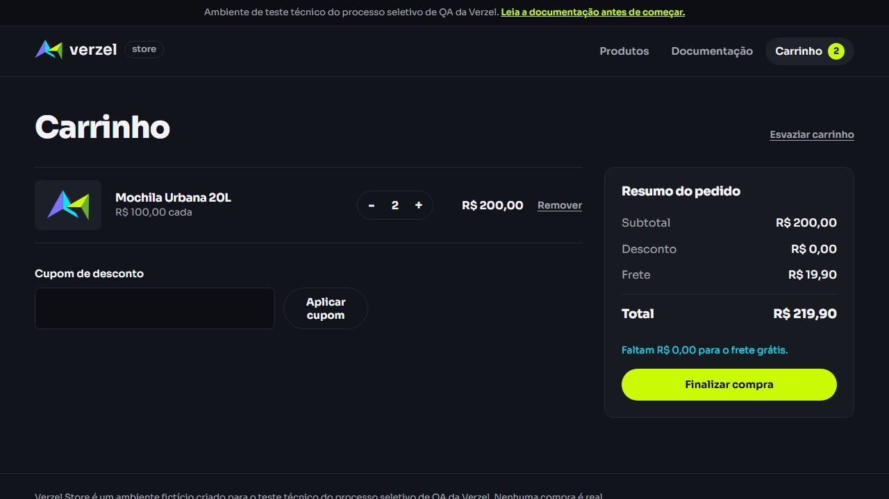
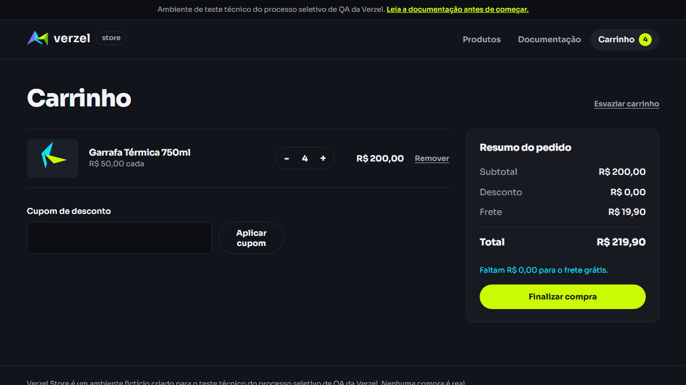
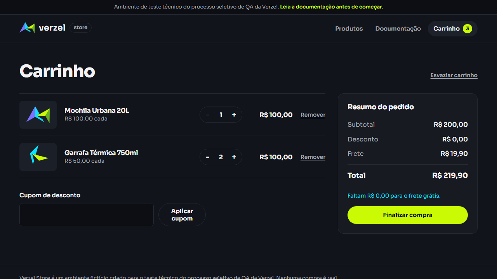

# Evidências da execução

Evidências geradas pela execução automatizada dos cenários com Playwright. Os resultados cenário a cenário estão em [`execucao-testes.md`](execucao-testes.md) e os bugs em [`bugs.md`](bugs.md).

## Execução automatizada

| | |
|---|---|
| Comando | `npm test` |
| Data e hora | 06/10/2026, 12:30 (horário de Brasília) |
| Ambiente | https://verzel-store.qa-test-verzel-store.workers.dev/ |
| Ferramentas | Playwright 1.63.0 e playwright-bdd 9.2.1, no Windows |
| Navegador | Chromium (projeto `ui`). Os cenários de API não usam navegador |
| Workers | 4 |
| Duração | 1 min 21 s |
| Resultado | 143 testes: 129 passaram e 14 falharam. Nenhum instável e nenhum pulado |

| Arquivo | Testes | Passaram | Falharam |
|---|---|---|---|
| [`features/ui/cupom.feature`](../features/ui/cupom.feature) | 17 | 17 | 0 |
| [`features/ui/frete.feature`](../features/ui/frete.feature) | 18 | 14 | 4 |
| [`features/ui/limite-quantidade.feature`](../features/ui/limite-quantidade.feature) | 6 | 6 | 0 |
| [`features/ui/checkout.feature`](../features/ui/checkout.feature) | 13 | 13 | 0 |
| [`features/api/carrinho-calculo.feature`](../features/api/carrinho-calculo.feature) | 37 | 31 | 6 |
| [`features/api/pedidos.feature`](../features/api/pedidos.feature) | 31 | 28 | 3 |
| [`features/api/contrato-erros.feature`](../features/api/contrato-erros.feature) | 21 | 20 | 1 |
| **Total** | **143** | **129** | **14** |

Os 14 testes que falharam são exatamente os marcados com `@bug`. Eles conferem o que a documentação pede e falham porque a loja não cumpre.

Os vídeos dos 4 testes de interface que falharam foram gravados em uma segunda execução, só dos cenários `@bug` (`npm run test:bugs`), em 06/10/2026 às 19:35. O resultado foi o mesmo: os 14 testes falharam. Os testes de API não abrem navegador e por isso não têm vídeo.

A execução também gera os relatórios completos em `playwright-report/` (com trace dos testes que falharam) e `cucumber-report/`. Eles não ficam no repositório por causa do tamanho. Para gerar de novo: `npm test` e depois `npm run report`.

## Evidências dos bugs

Para cada teste que falhou: o que foi verificado, o valor esperado e o valor obtido, como saíram no relatório do Playwright.

### BUG-01 | Frete de R$ 19,90 é cobrado com subtotal de exatamente R$ 200,00

Descrição e passos em [`bugs.md`](bugs.md#bug-01).

**CT-UI-11 A partir de R$ 200,00 o frete é grátis para "2x Mochila Urbana 20L"**



Vídeo da execução: [`CT-UI-11-exemplo-3.webm`](evidencias/CT-UI-11-exemplo-3.webm)

| Verificação | Esperado | Obtido |
|---|---|---|
| Frete | `Grátis` | `R$ 19,90` |
| Total | `R$ 200,00` | `R$ 219,90` |
| Avisos de valor faltante na tela | `0` | `1` |

**CT-UI-11 A partir de R$ 200,00 o frete é grátis para "4x Garrafa Térmica 750ml"**



Vídeo da execução: [`CT-UI-11-exemplo-4.webm`](evidencias/CT-UI-11-exemplo-4.webm)

| Verificação | Esperado | Obtido |
|---|---|---|
| Frete | `Grátis` | `R$ 19,90` |
| Total | `R$ 200,00` | `R$ 219,90` |
| Avisos de valor faltante na tela | `0` | `1` |

**CT-UI-11 A partir de R$ 200,00 o frete é grátis para "1x Mochila Urbana 20L, 2x Garrafa Térmica 750ml"**



Vídeo da execução: [`CT-UI-11-exemplo-5.webm`](evidencias/CT-UI-11-exemplo-5.webm)

| Verificação | Esperado | Obtido |
|---|---|---|
| Frete | `Grátis` | `R$ 19,90` |
| Total | `R$ 200,00` | `R$ 219,90` |
| Avisos de valor faltante na tela | `0` | `1` |

**CT-UI-13 Subtotal de exatamente R$ 200,00 com cupom mantém o frete grátis**


Vídeo da execução: [`CT-UI-13.webm`](evidencias/CT-UI-13.webm)

| Verificação | Esperado | Obtido |
|---|---|---|
| Frete | `Grátis` | `R$ 19,90` |
| Total | `R$ 180,00` | `R$ 199,90` |
| Avisos de valor faltante na tela | `0` | `1` |

**CT-API-01 Cálculo sem cupom para "2x P005"**

| Verificação | Esperado | Obtido |
|---|---|---|
| frete | `0` | `19.9` |
| total | `200` | `219.9` |
| freteGratis | `true` | `false` |

**CT-API-01 Cálculo sem cupom para "4x P008"**

| Verificação | Esperado | Obtido |
|---|---|---|
| frete | `0` | `19.9` |
| total | `200` | `219.9` |
| freteGratis | `true` | `false` |

**CT-API-01 Cálculo sem cupom para "1x P005, 2x P008"**

| Verificação | Esperado | Obtido |
|---|---|---|
| frete | `0` | `19.9` |
| total | `200` | `219.9` |
| freteGratis | `true` | `false` |

**CT-API-02 Cálculo com o cupom BEMVINDO10 para "2x P005"**

| Verificação | Esperado | Obtido |
|---|---|---|
| frete | `0` | `19.9` |
| total | `180` | `199.9` |

**CT-API-22 Pedido com subtotal de exatamente R$ 200,00 tem frete grátis**

| Verificação | Esperado | Obtido |
|---|---|---|
| frete | `0` | `19.9` |
| total | `200` | `219.9` |

### BUG-02 | API aceita mais de 5 unidades do mesmo produto

Descrição e passos em [`bugs.md`](bugs.md#bug-02).

**CT-API-06 O cálculo recusa mais de 5 unidades por produto: 6**

| Verificação | Esperado | Obtido |
|---|---|---|
| Status HTTP | `422` | `200` |

Corpo recebido:

```json
{
  "itens": [
    {
      "produtoId": "P008",
      "nome": "Garrafa Térmica 750ml",
      "precoUnitario": 50,
      "quantidade": 6,
      "total": 300
    }
  ],
  "subtotal": 300,
  "desconto": 0,
  "frete": 0,
  "freteGratis": true,
  "valorFaltanteFreteGratis": 0,
  "total": 300,
  "cupom": null
}
```

**CT-API-06 O cálculo recusa mais de 5 unidades por produto: 10**

| Verificação | Esperado | Obtido |
|---|---|---|
| Status HTTP | `422` | `200` |

Corpo recebido:

```json
{
  "itens": [
    {
      "produtoId": "P008",
      "nome": "Garrafa Térmica 750ml",
      "precoUnitario": 50,
      "quantidade": 10,
      "total": 500
    }
  ],
  "subtotal": 500,
  "desconto": 0,
  "frete": 0,
  "freteGratis": true,
  "valorFaltanteFreteGratis": 0,
  "total": 500,
  "cupom": null
}
```

**CT-API-28 Pedido com mais de 5 unidades do mesmo produto é recusado: 6**

| Verificação | Esperado | Obtido |
|---|---|---|
| Status HTTP | `422` | `201` |

Corpo recebido:

```json
{
  "numero": "VZ-116822",
  "criadoEm": "2026-10-06T15:31:09.878Z",
  "cliente": {
    "nome": "Maria Silva",
    "email": "maria@exemplo.com",
    "cep": "01310100"
  },
  "itens": [
    {
      "produtoId": "P008",
      "nome": "Garrafa Térmica 750ml",
      "precoUnitario": 50,
      "quantidade": 6,
      "total": 300
    }
  ],
  "subtotal": 300,
  "desconto": 0,
  "frete": 0,
  "freteGratis": true,
  "valorFaltanteFreteGratis": 0,
  "total": 300,
  "cupom": null
}
```

**CT-API-28 Pedido com mais de 5 unidades do mesmo produto é recusado: 10**

| Verificação | Esperado | Obtido |
|---|---|---|
| Status HTTP | `422` | `201` |

Corpo recebido:

```json
{
  "numero": "VZ-358737",
  "criadoEm": "2026-10-06T15:31:09.945Z",
  "cliente": {
    "nome": "Maria Silva",
    "email": "maria@exemplo.com",
    "cep": "01310100"
  },
  "itens": [
    {
      "produtoId": "P008",
      "nome": "Garrafa Térmica 750ml",
      "precoUnitario": 50,
      "quantidade": 10,
      "total": 500
    }
  ],
  "subtotal": 500,
  "desconto": 0,
  "frete": 0,
  "freteGratis": true,
  "valorFaltanteFreteGratis": 0,
  "total": 500,
  "cupom": null
}
```

### BUG-03 | Item sem `produtoId` devolve `PRODUTO_NAO_ENCONTRADO` com "undefined" na mensagem

Descrição e passos em [`bugs.md`](bugs.md#bug-03).

**CT-API-48 Item sem produtoId é recusado como item inválido**

| Verificação | Esperado | Obtido |
|---|---|---|
| Código de erro | `ITEM_INVALIDO` | `PRODUTO_NAO_ENCONTRADO` |

Corpo recebido:

```json
{
  "erro": {
    "codigo": "PRODUTO_NAO_ENCONTRADO",
    "mensagem": "Produto undefined não encontrado.",
    "campo": "itens[0].produtoId"
  }
}
```

## Prints dos cenários de interface

Um print por teste, tirado pelo Playwright ao final do cenário. São 54 prints, na pasta [`evidencias/`](evidencias/).

### Cupom de desconto

| Teste | Resultado | Print |
|---|---|---|
| CT-UI-01 Cupom válido é aceito quando digitado como "BEMVINDO10" | Passou | [abrir](evidencias/CT-UI-01-exemplo-1.png) |
| CT-UI-01 Cupom válido é aceito quando digitado como "bemvindo10" | Passou | [abrir](evidencias/CT-UI-01-exemplo-2.png) |
| CT-UI-01 Cupom válido é aceito quando digitado como "BemVindo10" | Passou | [abrir](evidencias/CT-UI-01-exemplo-3.png) |
| CT-UI-01 Cupom válido é aceito quando digitado como "[espaço][espaço]BEMVINDO10" | Passou | [abrir](evidencias/CT-UI-01-exemplo-4.png) |
| CT-UI-01 Cupom válido é aceito quando digitado como "BEMVINDO10[espaço][espaço]" | Passou | [abrir](evidencias/CT-UI-01-exemplo-5.png) |
| CT-UI-01 Cupom válido é aceito quando digitado como "[espaço]bemvindo10[espaço][espaço]" | Passou | [abrir](evidencias/CT-UI-01-exemplo-6.png) |
| CT-UI-02 Cupom inexistente "NAOEXISTE" é recusado | Passou | [abrir](evidencias/CT-UI-02-exemplo-1.png) |
| CT-UI-02 Cupom inexistente "BEM VINDO10" é recusado | Passou | [abrir](evidencias/CT-UI-02-exemplo-2.png) |
| CT-UI-02 Cupom inexistente "BEMVINDO" é recusado | Passou | [abrir](evidencias/CT-UI-02-exemplo-3.png) |
| CT-UI-02 Cupom inexistente "BEMVINDO15" é recusado | Passou | [abrir](evidencias/CT-UI-02-exemplo-4.png) |
| CT-UI-03 Cupom expirado "VERAO2026" é recusado | Passou | [abrir](evidencias/CT-UI-03-exemplo-1.png) |
| CT-UI-03 Cupom expirado "[espaço]verao2026[espaço]" é recusado | Passou | [abrir](evidencias/CT-UI-03-exemplo-2.png) |
| CT-UI-04 Com um cupom aplicado não é possível informar outro | Passou | [abrir](evidencias/CT-UI-04.png) |
| CT-UI-05 Remover o cupom zera o desconto e recalcula o total | Passou | [abrir](evidencias/CT-UI-05.png) |
| CT-UI-06 Trocar de cupom exige remover o atual antes | Passou | [abrir](evidencias/CT-UI-06.png) |
| CT-UI-07 O desconto acompanha a mudança de quantidade | Passou | [abrir](evidencias/CT-UI-07.png) |
| CT-UI-08 Aplicar com o campo de cupom vazio pede um código | Passou | [abrir](evidencias/CT-UI-08.png) |

### Frete grátis

| Teste | Resultado | Print |
|---|---|---|
| CT-UI-10 Abaixo de R$ 200,00 cobra frete fixo e informa quanto falta (subtotal R$ 29,90) | Passou | [abrir](evidencias/CT-UI-10-exemplo-1.png) |
| CT-UI-10 Abaixo de R$ 200,00 cobra frete fixo e informa quanto falta (subtotal R$ 59,90) | Passou | [abrir](evidencias/CT-UI-10-exemplo-2.png) |
| CT-UI-10 Abaixo de R$ 200,00 cobra frete fixo e informa quanto falta (subtotal R$ 189,90) | Passou | [abrir](evidencias/CT-UI-10-exemplo-3.png) |
| CT-UI-10 Abaixo de R$ 200,00 cobra frete fixo e informa quanto falta (subtotal R$ 199,90) | Passou | [abrir](evidencias/CT-UI-10-exemplo-4.png) |
| CT-UI-11 A partir de R$ 200,00 o frete é grátis para "3x Garrafa Térmica 750ml, 1x Camiseta Essencial" | Passou | [abrir](evidencias/CT-UI-11-exemplo-1.png) |
| CT-UI-11 A partir de R$ 200,00 o frete é grátis para "1x Jaqueta Corta-Vento" | Passou | [abrir](evidencias/CT-UI-11-exemplo-2.png) |
| CT-UI-11 A partir de R$ 200,00 o frete é grátis para "2x Mochila Urbana 20L" | **Falhou** (BUG-01) | [abrir](evidencias/CT-UI-11-exemplo-3.png) |
| CT-UI-11 A partir de R$ 200,00 o frete é grátis para "4x Garrafa Térmica 750ml" | **Falhou** (BUG-01) | [abrir](evidencias/CT-UI-11-exemplo-4.png) |
| CT-UI-11 A partir de R$ 200,00 o frete é grátis para "1x Mochila Urbana 20L, 2x Garrafa Térmica 750ml" | **Falhou** (BUG-01) | [abrir](evidencias/CT-UI-11-exemplo-5.png) |
| CT-UI-12 O frete grátis considera o subtotal antes do desconto | Passou | [abrir](evidencias/CT-UI-12.png) |
| CT-UI-13 Subtotal de exatamente R$ 200,00 com cupom mantém o frete grátis | **Falhou** (BUG-01) | [abrir](evidencias/CT-UI-13.png) |
| CT-UI-14 O desconto do cupom não incide sobre o frete (subtotal R$ 100,00) | Passou | [abrir](evidencias/CT-UI-14-exemplo-1.png) |
| CT-UI-14 O desconto do cupom não incide sobre o frete (subtotal R$ 199,90) | Passou | [abrir](evidencias/CT-UI-14-exemplo-2.png) |
| CT-UI-15 O frete muda quando o carrinho cruza o limite nos dois sentidos | Passou | [abrir](evidencias/CT-UI-15.png) |
| CT-UI-16 Os valores da tela são os mesmos calculados pela API: 3x Camiseta Essencial | Passou | [abrir](evidencias/CT-UI-16-exemplo-1.png) |
| CT-UI-16 Os valores da tela são os mesmos calculados pela API: 1x Calça Jeans Slim, 2x Boné Aba Curva | Passou | [abrir](evidencias/CT-UI-16-exemplo-2.png) |
| CT-UI-16 Os valores da tela são os mesmos calculados pela API: 3x Kit 3 Pares de Meias, 1x Boné Aba Curva | Passou | [abrir](evidencias/CT-UI-16-exemplo-3.png) |
| CT-UI-17 Carrinho vazio não exibe resumo nem aviso de frete | Passou | [abrir](evidencias/CT-UI-17.png) |

### Limite de 5 unidades por produto

| Teste | Resultado | Print |
|---|---|---|
| CT-UI-20 O carrinho permite aumentar até 5 unidades e bloqueia a sexta | Passou | [abrir](evidencias/CT-UI-20.png) |
| CT-UI-21 A vitrine bloqueia o produto depois de 5 unidades adicionadas | Passou | [abrir](evidencias/CT-UI-21.png) |
| CT-UI-22 O limite vale por produto, não pelo carrinho inteiro | Passou | [abrir](evidencias/CT-UI-22.png) |
| CT-UI-23 A quantidade mínima no carrinho é 1 | Passou | [abrir](evidencias/CT-UI-23.png) |
| CT-UI-24 Remover um item recalcula o resumo | Passou | [abrir](evidencias/CT-UI-24.png) |
| CT-UI-25 Esvaziar o carrinho remove todos os itens | Passou | [abrir](evidencias/CT-UI-25.png) |

### Finalização da compra

| Teste | Resultado | Print |
|---|---|---|
| CT-UI-30 Pedido com cupom é confirmado com os valores do carrinho | Passou | [abrir](evidencias/CT-UI-30.png) |
| CT-UI-31 Pedido com frete grátis e CEP sem hífen é confirmado | Passou | [abrir](evidencias/CT-UI-31.png) |
| CT-UI-32 Dados inválidos do cliente impedem o pedido: nome sem sobrenome | Passou | [abrir](evidencias/CT-UI-32-exemplo-1.png) |
| CT-UI-32 Dados inválidos do cliente impedem o pedido: nome vazio | Passou | [abrir](evidencias/CT-UI-32-exemplo-2.png) |
| CT-UI-32 Dados inválidos do cliente impedem o pedido: e-mail sem arroba | Passou | [abrir](evidencias/CT-UI-32-exemplo-3.png) |
| CT-UI-32 Dados inválidos do cliente impedem o pedido: e-mail sem domínio | Passou | [abrir](evidencias/CT-UI-32-exemplo-4.png) |
| CT-UI-32 Dados inválidos do cliente impedem o pedido: e-mail vazio | Passou | [abrir](evidencias/CT-UI-32-exemplo-5.png) |
| CT-UI-32 Dados inválidos do cliente impedem o pedido: CEP com 7 dígitos | Passou | [abrir](evidencias/CT-UI-32-exemplo-6.png) |
| CT-UI-32 Dados inválidos do cliente impedem o pedido: CEP com 9 dígitos | Passou | [abrir](evidencias/CT-UI-32-exemplo-7.png) |
| CT-UI-32 Dados inválidos do cliente impedem o pedido: CEP com letras | Passou | [abrir](evidencias/CT-UI-32-exemplo-8.png) |
| CT-UI-32 Dados inválidos do cliente impedem o pedido: CEP vazio | Passou | [abrir](evidencias/CT-UI-32-exemplo-9.png) |
| CT-UI-33 Todos os campos inválidos são apontados de uma vez | Passou | [abrir](evidencias/CT-UI-33.png) |
| CT-UI-34 Não é possível finalizar a compra com o carrinho vazio | Passou | [abrir](evidencias/CT-UI-34.png) |

## Cenários de API

Os cenários de API não têm tela. A evidência é o resultado de cada teste no Playwright, abaixo, e os valores devolvidos pela API, registrados em [`execucao-testes.md`](execucao-testes.md).

| Cenário | Testes | Passaram | Falharam |
|---|---|---|---|
| CT-API-01 | 10 | 7 | **3** (BUG-01) |
| CT-API-02 | 8 | 7 | **1** (BUG-01) |
| CT-API-03 | 5 | 5 | 0 |
| CT-API-04 | 4 | 4 | 0 |
| CT-API-05 | 2 | 2 | 0 |
| CT-API-06 | 2 | 0 | **2** (BUG-02) |
| CT-API-07 | 5 | 5 | 0 |
| CT-API-08 | 1 | 1 | 0 |
| CT-API-20 | 1 | 1 | 0 |
| CT-API-21 | 3 | 3 | 0 |
| CT-API-22 | 1 | 0 | **1** (BUG-01) |
| CT-API-23 | 2 | 2 | 0 |
| CT-API-24 | 11 | 11 | 0 |
| CT-API-25 | 1 | 1 | 0 |
| CT-API-26 | 4 | 4 | 0 |
| CT-API-27 | 1 | 1 | 0 |
| CT-API-28 | 2 | 0 | **2** (BUG-02) |
| CT-API-29 | 3 | 3 | 0 |
| CT-API-30 | 1 | 1 | 0 |
| CT-API-31 | 1 | 1 | 0 |
| CT-API-40 | 1 | 1 | 0 |
| CT-API-41 | 1 | 1 | 0 |
| CT-API-42 | 1 | 1 | 0 |
| CT-API-43 | 4 | 4 | 0 |
| CT-API-44 | 1 | 1 | 0 |
| CT-API-45 | 3 | 3 | 0 |
| CT-API-46 | 2 | 2 | 0 |
| CT-API-47 | 1 | 1 | 0 |
| CT-API-48 | 1 | 0 | **1** (BUG-03) |
| CT-API-49 | 1 | 1 | 0 |
| CT-API-50 | 1 | 1 | 0 |
| CT-API-51 | 4 | 4 | 0 |
